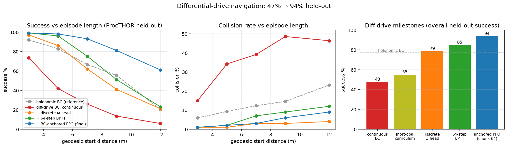

# fast-nav

Ultra-fast playground for indoor robot point-navigation with 2D lidar, built for RL/BC
research where rollout throughput is the bottleneck. Runs entirely on Apple-silicon GPU
via MLX custom Metal kernels.

**Measured on M2 Max (12-core, 32GB), 6 ReplicaCAD apartment scenes, 64 lidar rays:**

| num_envs | random actions | expert policy | expert + obs→numpy |
|---------:|---------------:|--------------:|-------------------:|
| 4 096    | 11.4M steps/s  | 10.4M         | 9.8M               |
| 16 384   | 26.4M steps/s  | 23.6M         | 20.0M              |
| 32 768   | 33.6M steps/s  | 31.2M         | 24.5M              |

Through the PufferLib env wrapper (obs written into pufferlib numpy buffers every step):
~9.7M steps/s at 8 192 envs. Expert success rate: 100.00% over 431k episodes across all
six scenes (zero timeouts).

## How it's fast

- **No 3D at runtime.** Each scene mesh is sliced once at the robot's height band
  (0.10–1.30 m), rasterized to a 2.5 cm occupancy grid, and converted to a signed
  **Euclidean distance field (EDF)**. 2D lidar = sphere tracing through the EDF
  (~15–30 bilinear samples per ray); collision = one EDF lookup + gradient projection.
- **Whole batch per dispatch.** Three Metal kernels per step (expert, step+auto-reset,
  lidar at N×R threads), built once via `mx.fast.metal_kernel`. Python overhead is
  amortized over 8k–32k envs; arrays stay resident in unified memory.
- **Zero per-episode planning.** Per scene, K=16 goals get precomputed
  **clearance-weighted geodesic distance fields** (Dijkstra, offline). The expert is
  smoothed gradient descent on the field — fully batched, naturally wall-avoiding,
  curved paths. The same fields provide episode sampling by difficulty (start tables
  sorted by geodesic distance) and, later, oracle distance for reward shaping.

## Robot model

Kinematic disk (radius 0.18 m), dt = 0.1 s, two drive types selected by
`SimConfig.kinematics` (everything drive-specific — Metal inlines, action limits,
observation frame, expert command conversion — lives in `fastnav/kinematics.py`):

- **holonomic** (default): no orientation state, continuous world-frame velocity
  command `(vx, vy)` ≤ 1.5 m/s. Lidar rays are fixed in the world frame.
- **diffdrive**: unicycle model for real-robot deployment — command `(v, ω)` with
  |v| ≤ 1.5 m/s, |ω| ≤ 2.5 rad/s. Lidar and the goal vector are body-frame; the
  geodesic expert converts its desired direction to `(v, ω)` with a P-controller on
  heading error and a cos⁴ speed gate (≥ holonomic expert success on held-out scenes).

Observation = `[lidar (R) | rel_goal (2) | pos (2)]` in the drive's observation frame —
ground-truth odometry given (unless the sim2real noise stack is on); the learning
problem is obstacle avoidance + navigation, not state estimation.

## Usage

```bash
uv sync
uv run python scripts/preprocess_replicacad.py   # GLB -> data/scenes/*.npz (+ debug PNGs)
uv run python tests/test_correctness.py          # lidar vs numpy ref, collision, expert
uv run python scripts/bench.py --scenes data/scenes
uv run python scripts/collect_demos.py --envs 2048 --steps 1024   # 2M transitions in <1s
uv run python scripts/render_mosaic.py --live    # live expert mosaic (or --out x.mp4)
```

Assets (6 baked apartment variations, ~56 MB, no auth):

```bash
uv run hf download ai-habitat/ReplicaCAD_baked_lighting --repo-type dataset \
  --include "stages_uncompressed/Baked_sc0_staging_0[0-2].glb" \
            "stages_uncompressed/Baked_sc[1-3]_staging_00.glb" \
            "configs/scenes/*.scene_instance.json" "urdf_uncompressed/**" \
  --local-dir data/replica_cad_baked
```

More scenes: the repo has 84 variations (`Baked_sc{0-3}_staging_{00-20}`); download more
and rerun the preprocess script. Doors are treated as open (door leaves skipped);
articulated furniture (fridge, kitchen counter, cabinets) is composited closed from the
URDFs.

## Layout

```
fastnav/scene.py        occupancy -> EDF -> geodesic fields -> episode tables; ScenePack
fastnav/sim.py          Metal kernels + batched Sim (step / lidar / expert)
fastnav/render.py       mosaic renderer (viz-only)
fastnav/puffer_env.py   PufferLib native vectorized env (rewards = 0, by design for now)
scripts/                preprocess, bench, collect_demos, render_mosaic
tests/                  kernel correctness vs numpy reference
```

## DAgger training (MLX-native, GPU-resident)

`scripts/train_dagger.py` runs hyper-online DAgger: PPO-shaped loop (rollout chunk
with the current policy → expert kernel labels every visited state → GPU ring buffer
→ compiled minibatch Adam updates), no transition ever touching host memory.
83k-param MLP (lidar+goal → velocity), continuous single-step actions.

Scene split: train on all sc0/sc1 furniture layouts (19), hold out all sc2/sc3 (6).
Baseline result on M2 Max: ~4.7M frames/s end-to-end; 99.7% success on train
layouts and ~89-90% on held-out layouts after 131M frames (~1 min wall clock).

```bash
uv run python scripts/train_dagger.py --iters 1600 --eval-every 200
```

## PPO fine-tuning (the generalization breakthrough)

BC/DAgger plateaus at ~80% held-out regardless of architecture/capacity (10-config
sweep) because the expert is privileged (it reads the geodesic field) and imitation
labels are Markov in state — long-horizon detour decisions aren't learnable from
per-frame labels. `scripts/train_ppo.py` fine-tunes with recurrent PPO on the
**geodesic-progress reward** (oracle Δcost-to-go, training-time only; scaled so the
BC value head is a near-correct critic at init).

Results (gru256, ~470 ProcTHOR + ReplicaCAD layouts, M2 Max):

| | train | ReplicaCAD held-out | ProcTHOR held-out |
|---|---:|---:|---:|
| BC/DAgger (best of sweep) | 86.0% | 78.9% | 86.3% |
| BC init used for PPO | 81.9% | 78.2% | 82.8% |
| + PPO fine-tune (~10 min) | 98.2% | **98.9%** | **97.2%** |

The dominant failure mode (oscillating at blocked direct paths instead of
committing to detours) is eliminated by optimizing the sequential objective
under the policy's own information state.

```bash
uv run python scripts/train_ppo.py --init checkpoints/gru256_bc/policy.safetensors
```

## Sim2real noise model

In-kernel sensor/actuator noise (`SimConfig`, all default 0): lidar range noise +
dropouts; SE(2) **odometry drift** (distance-scaled random walk + per-episode
calibration bias/scale — observations use the believed pose only); **heading drift**
(rotates the executed command and the reported lidar ring coherently); actuation
scale/additive noise. Expert and PPO reward stay privileged (asymmetric training).

Zero-shot, the clean-trained policy holds 94.5% under the full realistic stack
(98.0% at 0.5 m radius — most strict-radius loss is the physical drift floor, not
navigation failure). Odometry drift is the only component that materially bites;
heading drift is largely neutralized by the dihedral augmentation, and lidar /
actuation noise are free. PPO fine-tuning with 1.5x noise in rollouts
(`scripts/train_ppo.py --noise 1.5`) buys +1.6 at realistic and +8.4 at severe
levels for -1.3 clean. `scripts/noise_sweep.py` reproduces the grid.

## Contact-safe navigation

Contact is a **terminal failure** (`SimConfig.contact_margin`, 1cm default): the
constraint-projection sim otherwise lets policies lean on walls for free — the original
PPO champion touched geometry in >50% of episodes. Under the honest rule the expert
still scores 99.98%, prior checkpoints drop to 53-67%, and retraining with collision
terminals + clearance shaping (`checkpoints/ppo_contact2`) reaches **92.9% contact-free
success clean / 86.0% under realistic noise** on ReplicaCAD held-out (82.8/77.5 on
ProcTHOR, whose furniture gaps are tighter). Training note: collision terminals sharpen
the optimization landscape — the first run peaked then slid for 2000 iters; resuming
from the peak at 3x lower lr with a restored exploration floor fixed it.

## Differential drive: 47% → 94% held-out

The diff-drive policy now **matches the holonomic PPO line** (96.1% ReplicaCAD /
93.8% ProcTHOR held-out, 3-seed; 2.4% collision rate) despite the harder embodiment.
Naively reusing the holonomic recipe stalled at 47%, and the two unlocks generalize:



- **Categorical turn head** (`--head discrete_w`): the (v, ω) regression head was
  mode-averaging the left-vs-right turn decision — MSE pulls ω toward the useless
  midpoint of a bimodal label exactly in the ambiguous states where recovery happens
  (measured: near-perfect ω fit on-distribution, 62% turn-sign accuracy off). 15 ω bins
  + cross-entropy + argmax: 47% → 73% at equal budget, collisions 29% → 4%. Action
  heads are a strategy in `fastnav/policy.py` (head owns its BC loss and PPO
  distribution; trainers are head-agnostic), so new parameterizations are one class.
- **64-step BPTT** (`--chunk 64 --burn-in 8`, BC *and* PPO): the residual failures were
  near-goal wander loops — stable limit cycles of the (policy, GRU-hidden, env) closed
  loop. From identical stuck states the policy converts 19% keeping its hidden state vs
  67% with it wiped, yet 16-step BPTT gradients can never reach the recurrent dynamics
  that form the cycles (and holonomic episodes are ~2× shorter, which is why it never
  hit this). Matching the gradient horizon to the maneuver scale: BC 73 → 85 at 4×
  sample efficiency, and PPO flipped from eroding to a monotone +10 climb.
- **BC-anchored PPO** (`--bc-coef`): adds the head's BC loss against the expert labels
  (already computed for the reward oracle) to the PPO objective — stabilizes fine-tuning
  of weak inits, and is what makes erosion visible as a knob rather than a mystery.
  Procedural lesson learned twice: compare checkpoints on identical eval seeds only
  (±2pts noise at 2048 episodes once masked a real +5).

Recipe: `train_dagger.py --kinematics diffdrive --head discrete_w --recurrent --chunk 64
--burn-in 8 --updates-per-iter 16 --no-pos` (no augmentation — reflection+h0-zeroing
hurts the discrete head), then `train_ppo.py` same kinematics/head/chunk with
`--bc-coef 0.05 --lr 3e-5 --init-std 0.15 --entropy-coef 2e-3`. Champion:
`checkpoints/ppo_dd_disc64/policy_best.safetensors`. Also in-tree: a third kinematics
`diffdrive_vel` (body-frame velocity command through the expert's P-steering controller
— the natural `cmd_vel` deployment interface; as a *learning* action space it
underperformed end-to-end (v, ω), falsified twice with mechanism).

## Browser demo (held-out scenes, click-to-navigate)

`web/` is a dependency-free static app: pick any held-out scene (ReplicaCAD sc2/sc3 +
ProcTHOR Val/Test), click to set a goal, and watch the PPO policy navigate live.
Shift-click teleports the robot; speed up to 8× real time. The sim is a 1:1 JS port of
the Metal kernels (the browser recomputes the signed EDF from a 1-bit occupancy PNG with
an exact Felzenszwalb EDT), and the GRU-256 policy runs in plain JS at ~1 ms/step — no
WASM/WebGPU needed at one robot. The HUD shows the policy's own distance-to-go estimate,
recovered by inverting the critic (progress reward + discounted success bonus).

The sim2real noise stack is in the browser too — a noise control scales `noisy_config`
(off/½×/1×/2×), and with noise on the policy navigates on its believed odometry pose,
drawn as a dashed ghost ring with a live drift readout. At 2× you can watch the
dominant failure mode live: the robot parks at where it *believes* the goal is. A
policy picker switches between the clean-trained and noise-trained (`--noise 1.5`)
checkpoints to compare robustness.

Obstacle brushes make the generalization case directly: paint walls (or erase them)
while the robot drives — the EDF, lidar, and reachability are rebuilt live (~15 ms
exact EDT recompute), so you can block its route mid-run and watch it replan around
geometry that exists in no training scene. Sealing the goal off entirely raises a
live warning; "reset map" restores the original scene.

```bash
uv run python scripts/export_web.py   # scenes + policy -> web/ (add --fixture for parity data)
node web/test/parity.mjs              # JS sim+policy vs MLX: EDF exact, same trajectory
python3 -m http.server -d web 8473    # -> http://localhost:8473
```

## Next steps (not yet built)

- Reward design + PPO via pufferlib (3.0 trainer takes the env instance directly;
  note pufferlib 4.0 dropped the Python env API, so we pin 3.0.0)
- BC on `data/demos.npz`, DAgger (expert is queryable every step at full speed)
- Cross-scene generalization splits (train sc0–sc2 variants, eval sc3)
- Discrete-action wrapper if continuous PPO is finicky
